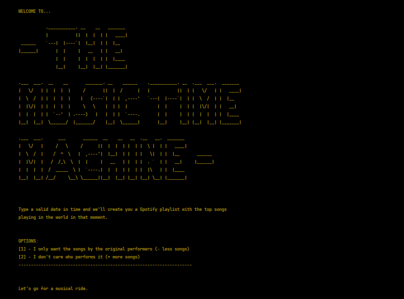

_This README.md file is in English and Portuguese. // Esse arquivo README.md está em Inglês e Português._
# EN: The Music Time Machine Project

This is my solution to the "Music Time Machine" challenge from _Dr. Angela Yu's Python Bootcamp_, from the London 
App Brewery.

### ( 🚧 - README.md file... is under Construction -  🚧)

## What do I need to run this?

1. **Python installed**
2. **A Spotify Account**
3. **To create your own Spotify App at [Spotify Developer Dashboard](https://developer.spotify.com/dashboard/)** 
   - (This repository code will be your App)
4. **Your own Spotify CLIENT_ID, CLIENT_SECRET and REDIRECT_URI**
   - (You will copy the CLIENT_ID and CLIENT_SECRET from your App in the Developer Dashboard - _Spotify will give 
         you this_)
   - (You will set your REDIRECT_URI in your App in the Developer Dashboard - _you will give this to Spotify_)
5. **To set your ENVIRONMENT VARIABLES in your Operating System (OS)**
   - (Your environment varibles are... your CLIENT_ID, CLIENT_SECRET and the chosen REDIRECT_URI) 
   - (This is a security measure. You don't want your credentials available to public.)
6. **Select a valid date in time**
   - (YYYY-MM-DD = YEAR-MONTH-DAY)

## More information at

- [How to create a Spotify App and its credentials]()
- [How to set your ENVIRONMENT VARIABLES]()
- [Screenshots of the App running]()

Enjoy! ;)

B.

