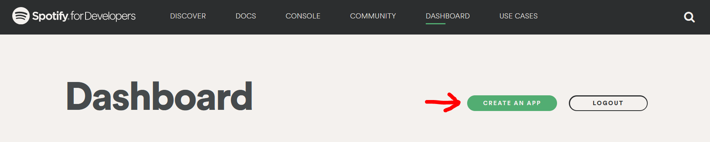
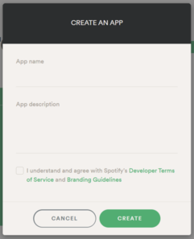
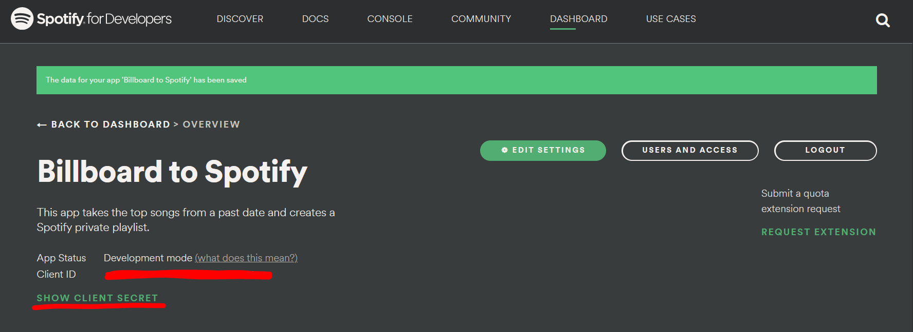
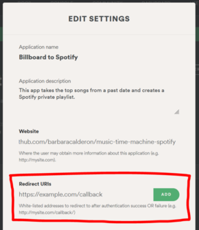
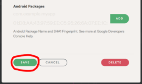

## How to create a Spotify App and its credentials

### This is required for Authentication at Spotify.

This is how I did it:

1. I already had a Spotify Account of my own. So I didn't need to create one from scratch. But if you don't have it, 
   then create one for youself at [Spotify](https://spotify.com).
2. I logged into Spotify.
3. I went to the [Spotify Developer Dashboard](https://developer.spotify.com/dashboard/) and clicked on "CREATE AN 
   APP" as follows:

4. I added an **App name** and **App description**, checked the box and clicked on "CREATE" as follows:

5. The Spotify will give your credentials (they will be your [ENVIRONMENT VARIABLES]() later on):

6. I clicked on "EDIT SETTINGS" (previous image) and inserted a value for REDIRECT_URIs, as follows:

7. Then I hit "SAVE", as follows:

**That's it.**

I have the three things I need:

- CLIENT_ID
- CLIENT_SECRET
- REDIRECT_URI

Now, I need to set these things as [ENVIRONMENT VARIABLES](ENV_VARIABLES.md).

